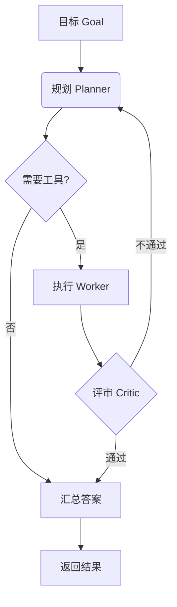

# 多智能体编排入门

单 Agent 适合线性任务；一旦任务有**规划、检索、执行、校验**多个环节，与其让一个模型硬扛，不如拆成多个角色协作。

## 核心三角色

- **Planner**：把目标拆成可执行的步骤
- **Worker**：执行具体子任务（调用工具 / 写代码）
- **Critic**：对结果做反思与纠错，形成闭环

> 反思循环（Reflect）是质量的分水岭：让 Critic 指出问题，Planner 再修正，比一次生成稳得多。

## 一个最小可运行骨架

```python
def run(goal):
    plan = planner(goal)
    for step in plan:
        result = worker(step)
        if not critic(result).ok:
            plan = planner(goal, feedback=critic(result).msg)
    return result
```

## 何时上多智能体

- 任务长、易出错、需要多次工具调用 → 值得
- 任务短、确定性高 → 单 Agent + 好 Prompt 更省 token

## 编排流程图



下一步可看 [[mcp/build-your-own-mcp|MCP]] 如何给这些 Agent 接上外部能力。
